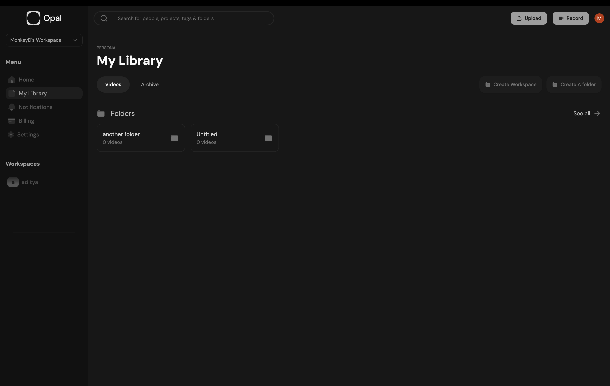
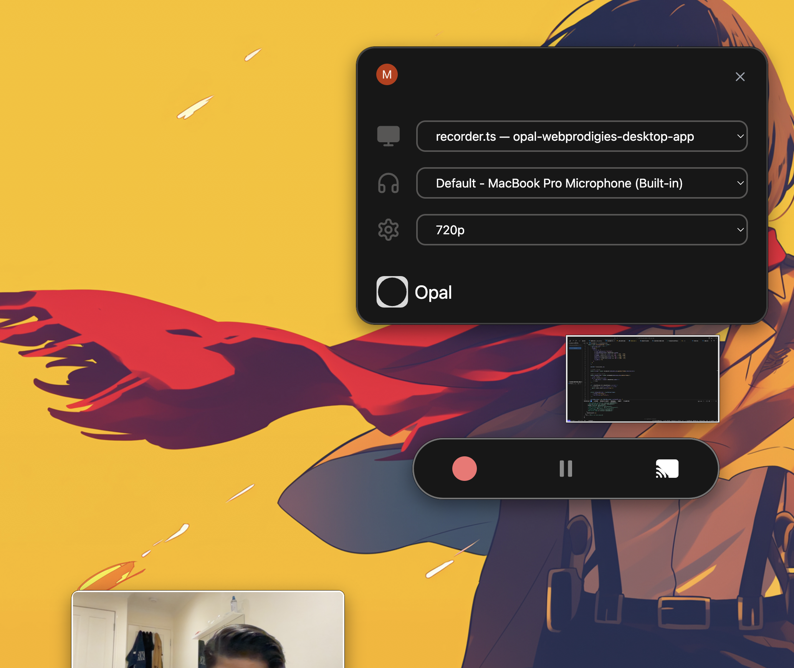

# Opal: AI SaaS Real-Time Video Recording and Sharing Application

Opal is an innovative AI-powered SaaS platform that enables real-time video recording, sharing, and management. Built with modern web and desktop technologies, it integrates seamless video recording functionalities with AI-generated transcripts and summaries. 

This project comprises:
- A **web application** for user authentication, video management, and sharing.
- An **Electron desktop application** for video recording and control functionalities.

---

## Features
- **Real-Time Video Recording**: Capture high-quality videos using the Electron desktop app.
- **AI-Powered Transcripts and Summaries**: Generate video transcripts and summaries with OpenAI's Whisper and GPT models.
- **Seamless Sharing**: Utilize AWS S3 and CloudFront for secure and scalable video storage and sharing.
- **User Authentication**: Manage user access using Clerk authentication.
- **State Management**: Use React Query and Redux for efficient state management.
- **Cross-Platform Communication**: Integrate Socket.io and REST APIs to connect the Electron app and Express backend with the web app.

---

## Technologies Used
### Web Application
- **Next.js**: Frontend and server-side rendering.
- **Tailwind CSS**: Styling.
- **Prisma**: Database ORM.
- **Clerk**: User authentication.
- **React Query and Redux**: State management.
- **AWS S3 and CloudFront**: Video storage and CDN.
- **OpenAI**: AI for generating video summaries and transcripts.

### Desktop Application
- **Electron**: Desktop application framework.
- **Next.js and shadcn**: UI for the desktop app.
- **Socket.io**: Real-time communication with the backend.

### Backend
- **Express**: Backend for video processing and S3 upload functionality.
- **Socket.io**: Handles video data streams.

---

## Folder Structure

### Web Application
```
opal-web
├── components
├── pages
│   ├── api
│   │   ├── recording
│   │   └── user
├── prisma
├── public
├── styles
├── utils
└── ...
```

### Electron Desktop Application
```
opal-electron
├── src
│   ├── main
│   ├── renderer
│   ├── components
│   └── utils
├── public
├── build
└── ...
```

---

## Installation

### Prerequisites
- Node.js
- Yarn or npm
- Docker (optional for containerized deployment)
- AWS Account with S3 and CloudFront set up

### Clone the Repository
```bash
git clone https://github.com/adeektya/Opal-video-rec.git
```

### Install Dependencies
#### Web Application
```bash
cd opal-web
yarn install
```

#### Electron Application
```bash
cd opal-electron
yarn install
```

---

## Running the Applications

### Web Application
```bash
cd opal-web
yarn dev
```
The web app will be available at [http://localhost:3000](http://localhost:3000).

### Electron Application
```bash
cd opal-electron
yarn start
```

---

## Deployment

### Web Application
1. Set up your `.env` file with the necessary variables (AWS keys, Clerk credentials, OpenAI API key, etc.).
2. Build the production version:
   ```bash
   yarn build
   yarn start
   ```

### Electron Application
Package the Electron app using `electron-builder`:
```bash
yarn run package
```

---

## Environment Variables
The application uses the following environment variables:

### Web Application
```
ACCESS_KEY=your-aws-access-key
SECRET_KEY=your-aws-secret-key
BUCKET_NAME=your-s3-bucket-name
BUCKET_REGION=your-s3-region
NEXT_PUBLIC_API_URL=http://localhost:5000
CLERK_API_KEY=your-clerk-api-key
OPENAI_API_KEY=your-openai-api-key
```

### Electron Application
```
ELECTRON_API_URL=http://localhost:5000
OPENAI_API_KEY=your-openai-api-key
```

---

## APIs and Endpoints
### Web App API
- `POST /api/recording/:userId/processing`: Starts video processing.
- `POST /api/recording/:userId/complete`: Completes video processing.

### Express App
- `POST /upload`: Upload video to AWS S3.
- `POST /transcribe`: Generate transcription and summary.

---

## Screenshots


---


---

## Author
**Aditya Krishna**

Feel free to reach out for collaboration or suggestions!
